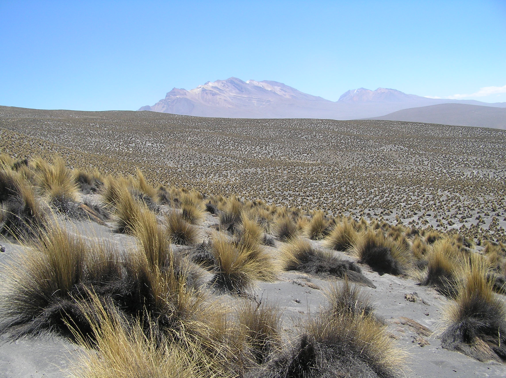

---
title:
author: "cjlortie & collaborators"
date: "2018"
output:
  html_document:
    theme: spacelab
    toc: yes
    toc_depth: 3
    toc_float: yes
  pdf_document:
    toc: yes
---
<br>  

###A synthesis of dryland restoration techniques.  

   

###Purpose
To quantitatively examine the efficacy of vegetation restoration in drylands globally.  

###Questions  
1. What is the global extent of research that directly examined restoration of drylands?  
2. What were the common measures?  
3. Is the restoration of vegetation a common and primary focus?  
4. How frequently does the restoration measure outcomes beyond the focal species?  
5. What were the primary restoration goals as reported by primary authors?  
6. How much variation was there in the techniques tested and how long were experiments monitored and tested?  
7. How relatively effective were the techniques?  

###Step 1. Search  
Study-level viz to document patterns in exclusions primarily and the relatie frequenices, at the study level, of major categories of evidence.  

```{r, studies, warning=FALSE, message=FALSE}
#study data####
library(tidyverse)
studies <- read_csv("data/studies.csv")
studies

#quick look at rationale needed
exclusions <- studies %>%
  filter(exclude == "yes")

#quick look at studies with paradigms
evidence <- studies %>%
  filter(exclude == "no")

#library(skimr)
#skim(evidence)

#study-level viz#####
#exclusions
#ggplot(exclusions, aes(rationale, fill = region)) +
 # geom_bar() +
 # coord_flip() +
 # labs(x = "rational for exclusion", y = "frequency") +
 # scale_fill_brewer(palette = "Paired")

ggplot(evidence, aes(disturbance, fill = paradigm)) +
  geom_bar(na.rm = TRUE) +
  coord_flip() +
  scale_fill_brewer(palette = "Paired") +
  labs(y = "frequency")

#ggplot(evidence, aes(region, fill = paradigm)) +
 # geom_bar(na.rm = TRUE) +
 # coord_flip() +
 # scale_fill_brewer(palette = "Paired") +
 # labs(y = "frequency")

#ggplot(evidence, aes(data, fill = paradigm)) +
 # geom_bar(na.rm = TRUE) +
  #coord_flip() +
  #scale_fill_brewer(palette = "Paired") +
  #labs(y = "frequency")

#ggplot(evidence, aes(system, fill = paradigm)) +
 # geom_bar(na.rm = TRUE) +
 # coord_flip() +
 # scale_fill_brewer(palette = "Paired") +
 # labs(y = "frequency")

#ggplot(evidence, aes(goal, fill = paradigm)) +
  #geom_bar(na.rm = TRUE) +
  #coord_flip() +
  #scale_fill_brewer(palette = "Paired") +
  #labs(x = "outcome", y = "frequency")

#step 1 models####
#paradigm
derived.evidence <- evidence %>%
  group_by(technique, data, region, disturbance, goal, paradigm) %>% summarise(n = n())

#active-passive split
m <- glm(n~paradigm, family = poisson, derived.evidence)
anova(m, test="Chisq")

#region
m1 <- glm(n~paradigm*region, family = poisson, derived.evidence)
#m1
#summary(m1)
anova(m1, test="Chisq")

#outcome
m2 <- glm(n~paradigm*goal, family = poisson, derived.evidence)
#m1
#summary(m1)
anova(m2, test="Chisq")

#even split between active and passive evidence by all key categories
```

###Step 2. Sort  
A summary of sort process using PRISMA.  

```{r, step 2, warning=FALSE, message=FALSE}
library(PRISMAstatement)
prisma(found = 1504,
       found_other = 5,
       no_dupes = 1039, 
       screened = 1039, 
       screen_exclusions = 861, 
       full_text = 178,
       full_text_exclusions = 101, 
       qualitative = 77, 
       quantitative = 66,
       width = 800, height = 800)
```

###Step 3. Synthesize  
Check data and calculate necessary measures.
```{r, step 3, warning=FALSE, message=FALSE}
#all data
#data <- read_csv("data/data.csv")
#data <- data %>%
  #mutate(lrr = log(mean.t/mean.c), rii = ((mean.t-mean.c)/(mean.t + mean.c)), var.es = ((sd.t^2/n.t*mean.t^2) + (sd.c^2/n.c*mean.c^2)))

#other effect size estimates
#library(compute.es)
#data <- data %>%
  #mutate(d=mes(mean.t, mean.c, sd.t, sd.c, n.t, n.c, level = 95, #cer = 0.2, dig = 2, , id = ID, data = data))
#check metafor

#data from ag and grazing studies that examined restoration in drylands
data <- read_csv("data/data.csv")
mydata<- data %>% 
 filter(disturbance %in% c("agriculture","grazing")) %>% 
filter(!notes %in% "couldnt extract data")

#write.csv(mydata, file="mydata.csv")

mydata <- mydata %>%
  mutate(lrr = log(mean.t/mean.c), rii = ((mean.t-mean.c)/(mean.t + mean.c)), var.es = ((sd.t^2/n.t*mean.t^2) + (sd.c^2/n.c*mean.c^2))) #use only lrr now

mydata<- mydata %>% 
  mutate(aridity.range = cut(aridity.index, breaks=c(0,5,10,20,25,69.92), labels=c("hyperarid","arid", "semiarid", "moderately arid", "slightly humid"))) #categorization of aridity.index values, according to de Martone
                     

```

###Step 4. Summarize  
Explore summary level data of all data. Explore aggregation levels that support the most reasonable data structure and minimize non-independence issues.  

```{r, step 4, warning=FALSE, message=FALSE}
#evidence map####
require(maps)
world<-map_data("world")
map<-ggplot() + geom_polygon(data=world, fill="gray50", aes(x=long, y=lat, group=group))
#map + geom_point(data=paperdata, aes(x=long, y=lat)) +
  #labs(x = "longitude", y = "latitude") #render a literal map, i.e. evidence map, of where we study the niche in deserts globally

#add in levels and color code points on map####
#map of 178 articles
map + geom_point(data=data, aes(x=long, y=lat, color = paradigm)) + 
  scale_color_brewer(palette = "Paired") +
  labs(x = "longitude", y = "latitude", color = "")

#map of selected articles, agriculture and grazing disturbances
map + geom_point(data=mydata, aes(x=long, y=lat, color = paradigm)) + 
  scale_color_brewer(palette = "Paired") +
  labs(x = "longitude", y = "latitude", color = "")

#aggregation####
se <- function(x){
  sd(x)/sqrt(length(x))
}

data.simple <- mydata %>%
  group_by(study.ID, paradigm, technique, measure.success) %>%
  summarise(n = n(), mean.lrr = mean(lrr), mean.rii = mean(rii), mean.var = mean(var.es))

main.data <- mydata %>%
  group_by(study.ID, paradigm, intervention, outcome) %>%
  summarise(n = n(), mean.lrr = mean(lrr), mean.rii = mean(rii), mean.var = mean(var.es))


#EDA data####
simple.data <- mydata %>% group_by(study.ID, paradigm, technique, measure.success) %>% summarise(mean.rii = mean(rii), error = se(rii))
simple.data <- na.omit(simple.data)

parad.data <- mydata %>% group_by(study.ID, paradigm) %>% summarise(mean.rii = mean(rii), error = se(rii))
parad.data <- na.omit(parad.data)

tech.data <- mydata %>% group_by(study.ID, technique) %>% summarise(mean.rii = mean(rii), error = se(rii))
tech.data <- na.omit(tech.data)

success.data <- mydata %>% group_by(study.ID, measure.success) %>% summarise(mean.rii = mean(rii), error = se(rii))
success.data <- na.omit(success.data)


#active
active <- mydata %>%
  filter(paradigm == "active")

#viz for aggregation####
disturbance.data <- mydata %>% 
  group_by(study.ID,disturbance, paradigm) %>% 
  count()

disturbance.data2 <- disturbance.data %>% 
  group_by(disturbance,paradigm) %>% 
  count()

ggplot(na.omit(disturbance.data2), aes(disturbance,nn, fill=paradigm))+ 
  geom_bar(stat = "identity") + 
  coord_flip(ylim=0:44) + 
  scale_fill_brewer(palette = "Blues")


intervention.data <- active %>% 
  group_by(study.ID,intervention, paradigm) %>% 
  count()

intervention.data2 <- intervention.data %>% 
  group_by(intervention,paradigm) %>% 
  count()

#ggplot(na.omit(intervention.data2), aes(intervention,nn, fill=paradigm)) +
  #geom_bar(stat = "identity") + 
  #coord_flip(ylim=0:44) + 
  #scale_fill_brewer(palette = "Blues")

technique.data <- mydata %>% 
  group_by(study.ID,technique, paradigm) %>% 
  count()

technique.data2 <- technique.data %>% 
  group_by(technique,paradigm) %>% 
  count()

technique.data3 <- technique.data2 %>% 
  group_by(technique) %>% 
  count()

aridity<- mydata %>% 
  group_by(continent) %>% summarize(mean.aridity=mean(aridity.index))
aridity  

table(mydata$aridity.index)


ggplot(na.omit(data.simple), aes(technique, n, fill = paradigm)) + 
  geom_bar(stat = "identity") + 
  coord_flip() + 
  scale_fill_brewer(palette = "Paired")

ggplot(na.omit(data.simple), aes(measure.success, n, fill = paradigm)) + 
  geom_bar(stat = "identity") + 
  coord_flip() + 
  scale_fill_brewer(palette = "Paired")

#better
ggplot(main.data, aes(intervention, n, fill = paradigm)) + 
  geom_bar(stat = "identity") + 
  coord_flip() + 
  scale_fill_brewer(palette = "Paired") +
  labs(fill = "")

ggplot(main.data, aes(outcome, n, fill = paradigm)) + 
  geom_bar(stat = "identity") + 
  coord_flip() + 
  scale_fill_brewer(palette = "Paired") +
  labs(fill = "")


```

###Step 5a. EDA  
Exploratory data analyses to understand data and QA/QC using Rii.

```{r, step 5a-rii, warning=FALSE, message=FALSE, fig.width=12, fig.height=12, echo=FALSE}
#library(plotrix) #for quick s.e. calculations sometimes needed for data tidy step
#library(meta) #nice package for most meta-statistics

#assign model (typically a nice meta. function from one of several packages such as meta, metafor, or netmeta)

#need to write a quick function here to iterate and/or up split-map from broom

#EDA####

#rii####
#paradigm
#m <- metagen(mean.rii, error, studlab = study.ID, byvar = paradigm, data = simple.data) #fit generic meta-analysis to an object
#summary(m)
#no difference in random effects model by paradigm but fixed yes. Hetereogeneity is significantly different so a. fixed not representative and b. need a better model
#forest(m,  xlim="symmetric", plotwidth=unit(1, "cm"))
#forest(m, sortvar = paradigm)
#radial(m)
#metabias(m, method = "linreg")

#technique
#m <- metagen(mean.rii, error, studlab = study.ID, byvar = technique, data = tech.data) #fit generic meta-analysis to an object
#m
#forest(m, sortvar = technique)
#radial(m)
#metabias(m, method = "linreg")

#measure
#m <- metagen(mean.rii, error, studlab = study.ID, byvar = measure.success, data = success.data) #fit generic meta-analysis to an object
#summary(m)
#forest(m, sortvar = measure.success)
#radial(m)
#metabias(m, method = "linreg")

#check data coding for passive intervention and outcome vectors too - not just active?
#explore above with intervention and outcome vectors
#do with ID as level not study.ID
#lrr

#rii anew with all data?
#m <- metagen(rii, var.es, studlab = ID, byvar = paradigm, data = data)
#summary(m)
#forest(m, sortvar = paradigm)
#radial(m)
#metabias(m, method = "linreg")

#m <- metagen(rii, var.es, studlab = study.ID, byvar = intervention, data = active)
#summary(m)
#forest(m, sortvar = paradigm)

#m <- metagen(rii, var.es, studlab = ID, byvar = outcome, data = na.exclude(data))
#summary(m)

#however repeat above for active only - for intervention and outcome - makes more sense


```

###Step 5b. Models    
Meta and conventional statistical models to explore relative efficacy.

```{r, step 5a-lrr, warning=FALSE, message=FALSE, fig.width=12, fig.height=12, echo=FALSE}


```


```{r, step 5b-rii, warning=FALSE, message=FALSE, echo=FALSE}
#effect sizes plots
#ggplot(main.data, aes(paradigm, mean.rii, color = intervention)) +
  #geom_point(position = position_dodge(width = 0.5)) + 
  #ylim(c(-1,1)) +
  #labs(x = "", y = "mean rii", color = "") +
  #coord_flip() +
  #geom_errorbar(aes(ymin=mean.rii-mean.var, ymax=mean.rii+mean.var), width=.05, position = position_dodge(width = 0.5)) +
  #geom_hline(yintercept = 0, colour="grey", linetype = "longdash")

#ggplot(simple.data, aes(paradigm, mean.rii, color = technique)) +
  #geom_point(position = position_dodge(width = 0.5)) + 
  #ylim(c(-1,1)) +
  #labs(x = "", y = "mean rii", color = "") +
  #coord_flip() +
  #geom_errorbar(aes(ymin=mean.rii-error, ymax=mean.rii+error), width=.05, position = position_dodge(width = 0.5)) +
  #geom_hline(yintercept = 0, colour="grey", linetype = #"longdash")

#ggplot(main.data, aes(paradigm, mean.rii, color = outcome)) +
  #geom_point(position = position_dodge(width = 0.5)) + 
  #ylim(c(-1,1)) +
  #labs(x = "", y = "mean rii") +
  #coord_flip() +
  #geom_errorbar(aes(ymin=mean.rii-mean.var, #ymax=mean.rii+mean.var), width=.05, position = position_dodge(width = 0.5)) +
  #geom_hline(yintercept = 0, colour="grey", linetype = "longdash")

#ggplot(simple.data, aes(paradigm, mean.rii, color = measure.success)) +
  #geom_point(position = position_dodge(width = 0.5)) + 
  #ylim(c(-1,1)) +
  #labs(x = "", y = "mean rii") +
  #coord_flip() +
  #geom_errorbar(aes(ymin=mean.rii-error, ymax=mean.rii+error), width=.05, position = position_dodge(width = 0.5)) +
  #geom_hline(yintercept = 0, colour="grey", linetype = "longdash")

#ggplot(active, aes(intervention, rii, color = outcome)) +
  #geom_point(position = position_dodge(width = 0.5)) + 
  #ylim(c(-1,1)) +
  #labs(x = "", y = "rii") +
  #coord_flip() +
  #geom_errorbar(aes(ymin=rii-var.es, ymax=rii+var.es), #width=.05, position = position_dodge(width = 0.5)) +
  #geom_hline(yintercept = 0, colour="grey", linetype = #"longdash")

#ggplot(active, aes(intervention, rii, color = outcome)) +
  #geom_boxplot() + 
  #ylim(c(-1,1)) +
  #labs(x = "", y = "rii") +
  #coord_flip() +
  #geom_errorbar(aes(ymin=rii-var.es, ymax=rii+var.es), width=.05, position = position_dodge(width = 0.5)) +
  #geom_hline(yintercept = 0, colour="grey", linetype = "longdash")

#simple.active <- active %>%
  #group_by(study.ID, outcome) %>%
  #summarise(n = n(), mean.rii = mean(rii), mean.var = #mean(var.es))

#t-tests if different from 0
#t-tests if mean rii different from mu = 0
#tmu <- function(x)
#{t.test(x, mu = 0, paired = FALSE, var.equal=FALSE, conf.level = #0.95)
#}

#data %>%
  #split(.$paradigm) %>%
  #purrr::map(~tmu(.$rii))

#active %>%
  #split(.$intervention) %>%
  #purrr::map(~tmu(.$rii))

#active %>%
  #split(.$outcome) %>%
  #purrr::map(~tmu(.$rii))

#meta-stats for active versus passive

#meta-stats for differences between interventions and outcomes for active test studies
```

Step 5. Synthesis stats  

```{r, synthesis, warning=FALSE, message=FALSE}
#p-value meta
#library(metap)
#all data for metas but cleaned for na's
#all data for meta cleaned
mdata.all <- mydata %>%
  filter(!is.na(lrr)) %>%
  filter(!is.na(var.es)) %>%
  filter(!is.na(n.t)) %>%
  filter(!is.na(p)) %>%
  filter(!is.na(intervention)) %>%
  filter(is.finite(lrr)) %>%
  filter(!is.na(exp.length)) %>%
  filter(!is.na(MAP)) %>%
  filter(!is.na(aridity.index)) #%>% 
  #filter(!is.infinite(var.es))

#active only data for meta cleaned up
mdata <- mydata %>%
  filter(paradigm == "active") %>%
  filter(!is.na(lrr)) %>%
  filter(!is.na(var.es)) %>%
  filter(!is.na(n.t)) %>%
  filter(!is.na(p)) %>%
  filter(!is.na(intervention)) %>%
  filter(is.finite(lrr)) %>%
  filter(!is.na(exp.length))

#aggregated data for metas var estimated with central tendency
#note - could also bootstrap mean variance here instead of arithematic mean
simple.mdata <- mdata %>%
  group_by(intervention) %>%
  summarise(lrr = mean(lrr), var.es = mean(var.es), n = mean(n.t))

simple.mdata.2 <- mdata %>%
  group_by(intervention, outcome) %>%
  summarise(lrr = mean(lrr), var.es = mean(var.es), n = mean(n.t))  

simple.mdata.var <- mdata %>%
  group_by(intervention) %>%
  summarise(lrr = mean(lrr), var.es = se(var.es), n = mean(n.t))

simple.mdata2.var <- mdata %>%
  group_by(intervention, outcome) %>%
  summarise(lrr = mean(lrr), var.es = se(var.es), n = mean(n.t))

#metas with p-values####
#schweder(mdata$p)
#sumz(p, data = mdata)
#mdata %>%
  #split(.$intervention) %>%
  #purrr::map(~sumz(.$p)) 
#sumlog(mdata$p)

#metas with meta package on effect size measures####
library(meta)
#all data non-aggregated
#m <- metagen(lrr, var.es, studlab = ID, byvar = intervention, data = mdata)
#summary(m)
#funnel(m)
#metabias(m)
#forest(m, sortvar = intervention)

#t-tests if different from 0

tmu <- function(x){t.test(x, mu = 0, paired = FALSE, var.equal=FALSE, conf.level = 0.95)}

mdata.all %>%
  split(.$paradigm) %>%
  purrr::map(~tmu(.$lrr)) #note this uses arithmetic means not estimated means from random effect models

#Propose we only use random effect models because of the diversity of studies, differences in the methods and samples that may introduce heterogeneity
m1 <- metagen(lrr, var.es, studlab = ID, byvar = paradigm, comb.fixed=FALSE, data = mdata.all)
summary(m1) #active is positive and passive is negative so should not mix
#metabias(m)
#should do a t-test right now of paradigm is diff from 0
#metareg(m1,aridity.range)


#interventions
m2 <- metagen(lrr, var.es, studlab = ID, byvar = intervention, comb.fixed=FALSE, subset = paradigm == "active", data = mdata.all)
summary(m2)
#metabias(m)
#metareg(m2, aridity.index)


#table(mydata$exp.length)
#mean(mydata$exp.length)
#explength.c <- with(mydata, exp.length - mean(exp.length))
#m2.c <- metareg(m2, explength.c)

m3 <- metagen(lrr, var.es, studlab = ID, byvar = intervention, subset = paradigm == "passive", comb.fixed=FALSE, data = mdata.all)
summary(m3)
#metabias(m)

#metareg(~ aridity.index, m) error

#continents and aridity index ranges
m4 <- metagen(lrr, var.es, studlab = ID, byvar = continent, subset = paradigm == "active", comb.fixed=FALSE, data = mdata.all)
summary(m4)

m5 <- metagen(lrr, var.es, studlab = ID, byvar = continent, subset = paradigm == "passive", comb.fixed=FALSE, data = mdata.all)
summary(m5)

m6 <- metagen(lrr, var.es, studlab = ID, byvar = aridity.range, comb.fixed=FALSE, data = mdata.all)
summary(m6)


#use random effects mean and var estimate to plot

#do t-tests here too

#outcomes
m <- metagen(lrr, var.es, studlab = ID, byvar = outcome, subset = paradigm == "active", comb.fixed=FALSE, data = mdata.all)
summary(m)
#metabias(m)

m <- metagen(lrr, var.es, studlab = ID, byvar = outcome, subset = paradigm == "passive", comb.fixed=FALSE, data = mdata.all)
summary(m)
#metabias(m)

#t-tests for outcomes diff from 0 but you can see using the 95% CI what is different

#check metafor for interactions?? in these big models or are we ok??

#brainstorm on how to explore?? techniques


#save but cut all this.
#m.study <- metagen(lrr, var.es, studlab = study.ID, byvar = intervention, data = mdata)
#summary(m.study)
#funnel(m)
#metabias(m)
#forest(m, sortvar = intervention)

#aggregated data
#m1 <- metagen(lrr, var.es, studlab = intervention, data = simple.mdata)
#summary(m1)
#funnel(m1)
#metabias(m1)
#forest(m, sortvar = intervention)

#different var estimate
#m2 <- metagen(lrr, var.es, studlab = intervention, data = simple.mdata.var)
#summary(m2)
#funnel(m2)
#metabias(m2)
#forest(m, sortvar = intervention)


#m3 <- metagen(lrr, var.es, studlab = intervention, byvar = outcome, data = simple.mdata.2)
#summary(m3)
#funnel(m)
#radial(m3)
#metabias(m2)
#forest(m, sortvar = intervention)

#m4 <- metagen(lrr, var.es, studlab = intervention, byvar = outcome, data = simple.mdata2.var)
#summary(m4)
#funnel(m)
#radial(m4)
#metabias(m2)
#forest(m, sortvar = intervention)

```


```{r, metafor, warning=FALSE, message=FALSE}
library(metafor)

#metadata<-escalc(measure="ROM",m1i=mean.t,m2i=mean.c,sd1i=sd.t,sd2i=sd.c,n1i=n.t,n2i=n.c, data=mydata,var.names=c("LRR","LRR_var"),digits=4)


mdata.mean<- mdata.all %>% 
  group_by(study.ID, aridity.index, exp.length, paradigm, intervention, outcome) %>% 
  summarize(mean_lrr= mean(lrr),
  mean_var.es= mean(var.es)) #collapsing data to means

mdata.mean<- mdata.mean %>%
  filter(!is.infinite(mean_var.es)) #filter out outliers that are infinite

mod.1<-rma(mean_lrr,mean_var.es, mods= intervention, subset= paradigm == "active", digits=4,data=mdata.mean)

mod.2<-rma.mv(yi=lrr, V=var.es, mods= ~ aridity.index, random = ~ 1 | ID, data=mdata.all, sparse=TRUE)

mod.3 <- rma(yi=lrr, vi=var.es, data = mdata.all)
summary(m3)


mod.4 <- rma(lrr, var.es, mods= cbind (aridity.index, exp.length), data = mdata.all, subset = paradigm == "active")
summary(m4)


mod.5 <- rma(lrr, var.es, mods= aridity.range, data = mdata.all, subset = paradigm == "active")
summary(m5)
```

```{r, metaplot, warning=FALSE, message=FALSE,fig.width=10, fig.height=14}

#forest(m1, sortvar = intervention, fontsize = 10, xlim = c(-2, 2))

#forest(m2, sortvar = intervention, fontsize = 10, xlim = c(-2, 2))

#forest(m3, sortvar = intervention, fontsize = 10, xlim = c(-2, 2))

#forest(m4, sortvar = intervention, fontsize = 10, xlim = c(-2, 2))

#t-tests for lrr diff from 0
#mdata %>%
  #split(.$intervention) %>%
  #purrr::map(~sumz(.$lrr)) 

```

```{r, eplots, warning=FALSE, message=FALSE}
#effect sizes plots
#need better ci estimates
#ggplot(simple.mdata, aes(intervention, lrr)) +
 # ylim(c(-2,2)) +
#  geom_point(position = position_dodge(width = 0.5)) + 
 # labs(x = "", y = "lrr") +
 # coord_flip() +
 # geom_errorbar(aes(ymin=lrr-var.es, ymax=lrr+var.es), width=.05, position = position_dodge(width = 0.5)) +
 # geom_hline(yintercept = 0, colour="grey", linetype = "longdash")

#ggplot(simple.mdata.2, aes(intervention, lrr, color = outcome)) +
 # ylim(c(-2,2)) +
  #geom_point(position = position_dodge(width = 0.5)) + 
 # labs(x = "", y = "lrr", color = "") +
 # coord_flip() +
  #geom_errorbar(aes(ymin=lrr-var.es, ymax=lrr+var.es), width=.05, position = #position_dodge(width = 0.5)) +
  #geom_hline(yintercept = 0, colour="grey", linetype = "longdash")

#ggplot(mdata, aes(lrr, color = intervention)) +
  #geom_freqpoly(binwidth = 0.5, size = 2) + 
  #xlim(c(-10, 10)) +
  #labs(x = "lrr", y = "frequency", color = "") +
  #geom_vline(xintercept = 0, colour="grey", linetype = "longdash") +
  #scale_color_brewer()

#ggplot(mdata, aes(lrr, fill = intervention)) +
  #geom_dotplot(binwidth = 1) + 
 # xlim(c(-10, 10)) +
 # labs(x = "lrr", y = "frequency", fill = "") +
 # geom_vline(xintercept = 0, colour="grey", linetype = "longdash") +
 # scale_fill_brewer()


```

###Interpretations  
1. Little to no replication of specific techniques.   
2. Intervention and outcome classification useful and appropriate.  
3. Active versus passive interesting and fascinating.  
4. Use only random effect model statistics because of heterogeneity and conceptual focus of data and synthesis.  
5. Active and passive are not the same - active is net positive and passive is net negative. Amazing finding.
6. Then subset out each of active passive and run a meta.  Found that both for active and passive, vegetation is a path forward for restoration (list techniques in paper) particularly active.
7. Adding water does not generate significant effects, soil remediation is powerful active intervention and ignoring passive changes in soil is a dramatic and negative impediment to restoration.  
8. Habitat is challenging to actively restore but plants, animals, and soils are viable and significant positive outcomes that can be restored.  
9. Passive restoration confirms that habitat does not generally respond, plants can recover passively, but soil does not.
10. Additional ideas - test ONE key moderator such as aridity index or length of experiment?